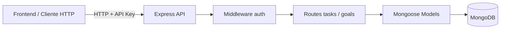

# To Do List — Backend API

API REST para la gestión de **tareas** y **metas personales**, con persistencia en **MongoDB**. Forma parte del proyecto full stack To Do List y se consume desde el frontend mediante Redux.

Repositorio frontend: [todo-list-class-one](https://github.com/mmazariegos-2021338/todo-list-class-one)

---

## Tabla de contenidos

- [Descripción general](#descripción-general)
- [Arquitectura](#arquitectura)
- [Stack tecnológico](#stack-tecnológico)
- [Estructura del proyecto](#estructura-del-proyecto)
- [Requisitos previos](#requisitos-previos)
- [Instalación y ejecución](#instalación-y-ejecución)
- [Autenticación](#autenticación)
- [API REST](#api-rest)
- [Modelos de datos](#modelos-de-datos)
- [Variables de entorno](#variables-de-entorno)
- [Integración con el frontend](#integración-con-el-frontend)

---

## Descripción general

Este backend expone endpoints para:

- Consultar tareas y metas almacenadas en MongoDB.
- Crear nuevas tareas y metas.
- Eliminar registros por ID.

Todas las rutas están protegidas con autenticación por **API Key** en el header `Authorization`.

---

## Arquitectura



| Componente   | Rol                                              |
|--------------|--------------------------------------------------|
| `index.js`   | Punto de entrada, middleware JSON y rutas        |
| `auth.js`    | Valida la API Key en cada petición               |
| `routes/`    | Define los endpoints CRUD                        |
| `models/`    | Esquemas Mongoose de Task y Goal                 |
| `config/db`  | Conexión a MongoDB al iniciar el servidor        |

---

## Stack tecnológico

- Node.js
- Express 5
- Mongoose 9
- MongoDB
- dotenv

---

## Estructura del proyecto

```
bakend-todo-list-class-one/
├── src/
│   ├── index.js              # Servidor Express
│   ├── config/
│   │   └── db.js             # Conexión a MongoDB
│   ├── middleware/
│   │   └── auth.js           # Autenticación por API Key
│   ├── models/
│   │   ├── Task.js           # Esquema de tareas
│   │   └── Goal.js           # Esquema de metas
│   └── routes/
│       ├── tasks.js          # Endpoints de tareas
│       └── goals.js          # Endpoints de metas
├── .env.example
└── package.json
```

---

## Requisitos previos

- Node.js 18+ (recomendado 20+)
- npm
- MongoDB en ejecución (local, Atlas o contenedor Docker)

---

## Instalación y ejecución

```bash
git clone https://github.com/mmazariegos-2021338/bakend-todo-list-class-one.git
cd bakend-todo-list-class-one
npm install
cp .env.example .env
npm run dev
```

El servidor quedará disponible en:

```
http://localhost:3000
```

> La conexión a MongoDB se establece al arrancar. Si `MONGODB_URI` es inválida o la base de datos no está disponible, el servidor no inicia.

---

## Autenticación

Todas las rutas requieren el header:

```
Authorization: my-api-key
```

El valor debe coincidir con la variable de entorno `API_KEY`.

| Código | Respuesta                          |
|--------|------------------------------------|
| 401    | Header `Authorization` no enviado  |
| 403    | API Key inválida                   |

---

## API REST

### Metas (Goals)

| Método | Endpoint      | Descripción       |
|--------|---------------|-------------------|
| GET    | `/getGoals`   | Listar metas      |
| POST   | `/addGoal`    | Crear meta        |
| DELETE | `/removeGoal` | Eliminar meta     |

**POST `/addGoal`**

```json
{
  "title": "Completar Unidad V",
  "description": "Entregar repositorio con CRUD funcional",
  "targetDate": "2026-05-27T00:00:00.000Z"
}
```

**DELETE `/removeGoal`**

```json
{
  "id": "681ff4b8ae3f78f8f88db6c1"
}
```

---

### Tareas (Tasks)

| Método | Endpoint      | Descripción        |
|--------|---------------|--------------------|
| GET    | `/getTasks`   | Listar tareas      |
| POST   | `/addTask`    | Crear tarea        |
| DELETE | `/removeTask` | Eliminar tarea     |

**POST `/addTask`**

```json
{
  "title": "Terminar actividad de backend",
  "description": "Crear endpoints con persistencia",
  "dueDate": "2026-05-27T00:00:00.000Z",
  "completed": false
}
```

**DELETE `/removeTask`**

```json
{
  "id": "681ff4b8ae3f78f8f88db6c1"
}
```

---

## Modelos de datos

### Task

| Campo         | Tipo    | Requerido | Descripción              |
|---------------|---------|-----------|--------------------------|
| `title`       | String  | Sí        | Nombre de la tarea       |
| `description` | String  | No        | Detalle adicional        |
| `dueDate`     | Date    | No        | Fecha límite             |
| `completed`   | Boolean | No        | Estado (default: false)  |

### Goal

| Campo         | Tipo   | Requerido | Descripción        |
|---------------|--------|-----------|--------------------|
| `title`       | String | Sí        | Nombre de la meta  |
| `description` | String | No        | Detalle adicional  |
| `targetDate`  | Date   | No        | Fecha objetivo     |

Ambos modelos incluyen timestamps automáticos (`createdAt`, `updatedAt`).

---

## Variables de entorno

| Variable       | Descripción                    | Ejemplo |
|----------------|--------------------------------|---------|
| `PORT`         | Puerto del servidor            | `3000`  |
| `API_KEY`      | Clave esperada en Authorization | `my-api-key` |
| `MONGODB_URI`  | URI de conexión a MongoDB      | `mongodb://localhost:27017/todo_list_db` |

---

## Integración con el frontend

El frontend ([todo-list-class-one](https://github.com/mmazariegos-2021338/todo-list-class-one)) consume este API mediante:

- Servicio HTTP en `src/services/api.ts`
- Redux Toolkit (`goalsSlice`, `tasksSlice`)
- Proxy de Vite en desarrollo (`localhost:5173` → `localhost:3000`)

Para que la integración funcione:

1. MongoDB debe estar activo.
2. Backend en puerto `3000`.
3. Frontend con `VITE_API_KEY` igual a `API_KEY` del backend.

También puede levantarse todo el stack con Docker desde el repositorio frontend:

```bash
docker compose up --build
```

---

## Scripts disponibles

| Comando       | Descripción                |
|---------------|----------------------------|
| `npm run dev` | Inicia el servidor Express |
| `npm start`   | Inicia el servidor         |

---

## Repositorio

Proyecto académico — **Semana 6**: API REST con MongoDB e integración con frontend React + Redux.
